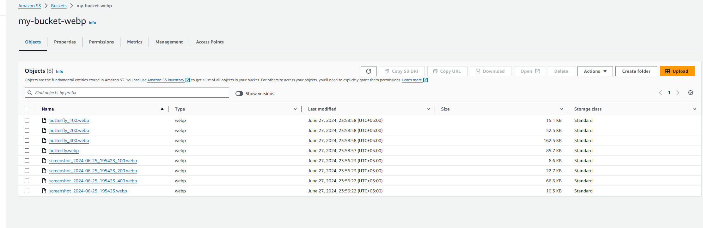

# image-converter

Test project

async upload JPEG, PNG, WEBP images on AWS S3 (or any S3-compatibility storage)

For running 
``
docker compose up
``

Or manual 

``
docker run --name=<name> -e POSTGRES_PASSWORD=<password> -p 5432:5432 -d postgres
``

``
migrate -path ./schema -database 'postgres://postgres:<password>@localhost:5432/postgres?sslmode=disable' up(down)
``

``
docker run -d --name redis-mq -p 6379:6379 redis
``

``
go run cmd/image-converter/main.go
``

  
TODO

* `//TODO check original resolution of image (set min value or change other sizes) first copy > original
* ~~//TODO change image -~~ 
* ~~//TODO delete on S3~~
* ~~//TODO delete on local~~
* //TODO change status in DB
* //TODO non-public bucket
* //TODO temporary key
* //TODO screenshot bucket and policy
* //TODO polymorphic keys in DB
* //TODO clean arc, SOLID
* //TODO write tests
* //TODO readme
* //TODO monitor bg workers asynqmon
* //TODO docker & docker-compose
* ~~//TODO makefile~~
* //TODO delete from s3 when update`

